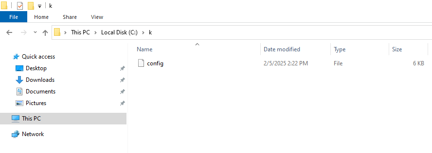

# 2 - Join a Windows worker node to Kubernetes

## 1. Preparation

On the control plane node, run

```
./calicoctl ipam configure --strictaffinity=true --allow-version-mismatch
```

On your laptop

```
Set-VMProcessor -VMName w25f -ExposeVirtualizationExtensions $true
```

Turn on the Windows VM

On Widows VM

```
Install-WindowsFeature -Name containers
Install-WindowsFeature -Name Hyper-V -IncludeManagementTools -Restart
```

## 2. Install containerd

```
curl.exe -LO https://raw.githubusercontent.com/kubernetes-sigs/sig-windows-tools/master/hostprocess/Install-Containerd.ps1

.\Install-Containerd.ps1 -ContainerDVersion 1.7.22
```

## 3. Install Calico

On Windows node

```
mkdir c:\k
mkdir 'C:\Program Files\containerd\cni\bin'
```

```
scp jakapong@172.23.163.83:/home/jakapong/.kube/config c:\k
```



```
Invoke-WebRequest https://github.com/projectcalico/calico/releases/download/v3.29.1/install-calico-windows.ps1 -OutFile c:\install-calico-windows.ps1

.\install-calico-windows.ps1 -KubeVersion 1.32.1 -CalicoBackend vxlan

Get-Service -Name CalicoNode
Get-Service -Name CalicoFelix
```

## 4. Install Kubernetes tools

```
C:\CalicoWindows\kubernetes\install-kube-services.ps1

Get-Service -Name kubelet
Get-Service -Name kube-proxy
```

## 5. Join a Windows worker not


