# 2 - Join a Windows worker node to Kubernetes

## 1. Preparation

On the control plane node, run

```
./calicoctl ipam configure --strictaffinity=true --allow-version-mismatch
```

On your laptop

```
Set-VMProcessor -VMName w19a -ExposeVirtualizationExtensions $true
```

Turn on the Windows VM

On Windows VM

- Change time zone to be same as the control plane node.
- Turn of Windows firewall

Run

```
Install-WindowsFeature -Name containers
Install-WindowsFeature -Name Hyper-V -IncludeManagementTools -Restart
```

## 2. Install containerd

Ref. https://github.com/containerd/containerd/blob/main/docs/getting-started.md?source=post_page-----50b61e6891ad--------------------------------#installing-containerd-on-windows

```
# If containerd previously installed run:
Stop-Service containerd

# Download and extract desired containerd Windows binaries
$Version="1.7.13"	# update to your preferred version
$Arch = "amd64"	# arm64 also available
curl.exe -LO https://github.com/containerd/containerd/releases/download/v$Version/containerd-$Version-windows-$Arch.tar.gz
tar.exe xvf .\containerd-$Version-windows-amd64.tar.gz

# Copy
Copy-Item -Path .\bin -Destination $Env:ProgramFiles\containerd -Recurse -Force

# add the binaries (containerd.exe, ctr.exe) in $env:Path
$Path = [Environment]::GetEnvironmentVariable("PATH", "Machine") + [IO.Path]::PathSeparator + "$Env:ProgramFiles\containerd"
[Environment]::SetEnvironmentVariable( "Path", $Path, "Machine")
# reload path, so you don't have to open a new PS terminal later if needed
$Env:Path = [System.Environment]::GetEnvironmentVariable("Path","Machine") + ";" + [System.Environment]::GetEnvironmentVariable("Path","User")

# configure
containerd.exe config default | Out-File $Env:ProgramFiles\containerd\config.toml -Encoding ascii
# Review the configuration. Depending on setup you may want to adjust:
# - the sandbox_image (Kubernetes pause image)
# - cni bin_dir and conf_dir locations
Get-Content $Env:ProgramFiles\containerd\config.toml

# Register and start service
containerd.exe --register-service
Start-Service containerd
```

## 3. Install Calico

On Windows node

```
mkdir c:\k
mkdir 'C:\Program Files\containerd\cni\bin'
```

```
scp jakapong@172.23.163.83:/home/jakapong/.kube/config c:\k
```

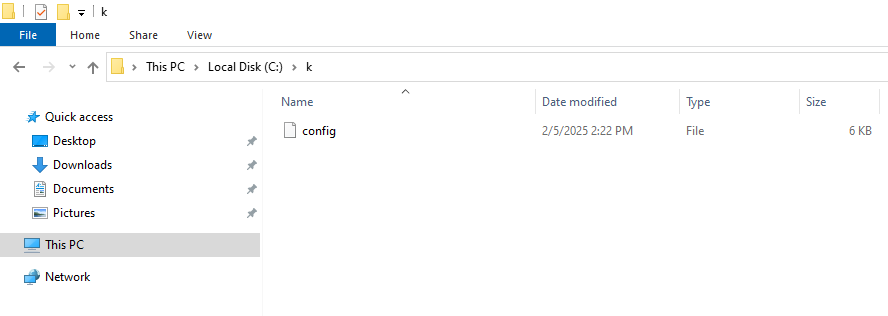

```
Invoke-WebRequest https://github.com/projectcalico/calico/releases/download/v3.29.1/install-calico-windows.ps1 -OutFile c:\install-calico-windows.ps1

.\install-calico-windows.ps1 -KubeVersion 1.32.1 -CalicoBackend vxlan

Get-Service -Name CalicoNode
Get-Service -Name CalicoFelix
```

## 4. Install Kubernetes tools

```
C:\CalicoWindows\kubernetes\install-kube-services.ps1

Start-Service -Name kubelet
Start-Service -Name kube-proxy

Stop-Service -Name kubelet

Get-Service -Name kubelet
Get-Service -Name kube-proxy
```

## 5. Join a Windows worker node

On the control plane node, run.

```
kubeadm token create --print-join-command
```

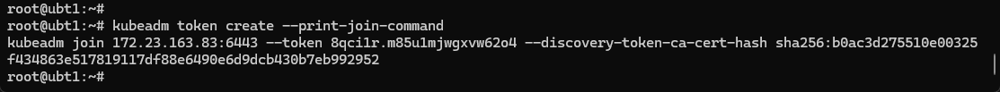

On the worker node, run

```
kubeadm join — token <token> <control-plane-host>:<control-plane-port> — discovery-token-ca-cert-hash sha256:<hash>
```

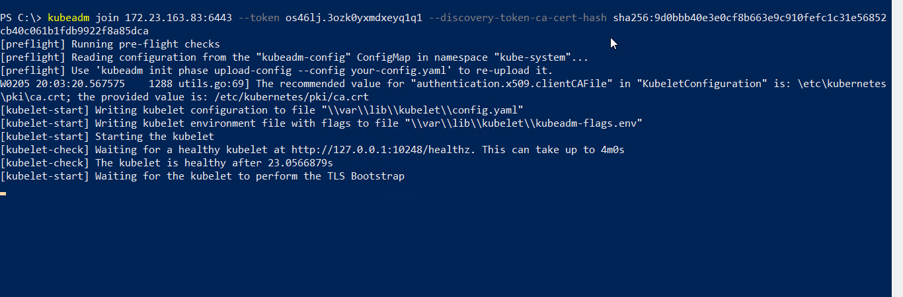

On control plane node

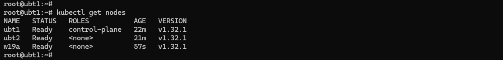

## 6. Test

Ref. https://kubernetes.io/docs/concepts/windows/user-guide/

win-webserver.yaml

```
---
apiVersion: v1
kind: Service
metadata:
  name: win-webserver
  labels:
    app: win-webserver
spec:
  ports:
    # the port that this service should serve on
    - port: 80
      targetPort: 80
  selector:
    app: win-webserver
  type: NodePort
---
apiVersion: apps/v1
kind: Deployment
metadata:
  labels:
    app: win-webserver
  name: win-webserver
spec:
  replicas: 2
  selector:
    matchLabels:
      app: win-webserver
  template:
    metadata:
      labels:
        app: win-webserver
      name: win-webserver
    spec:
     containers:
      - name: windowswebserver
        image: mcr.microsoft.com/windows/servercore:ltsc2019
        command:
        - powershell.exe
        - -command
        - "<#code used from https://gist.github.com/19WAS85/5424431#> ; $$listener = New-Object System.Net.HttpListener ; $$listener.Prefixes.Add('http://*:80/') ; $$listener.Start() ; $$callerCounts = @{} ; Write-Host('Listening at http://*:80/') ; while ($$listener.IsListening) { ;$$context = $$listener.GetContext() ;$$requestUrl = $$context.Request.Url ;$$clientIP = $$context.Request.RemoteEndPoint.Address ;$$response = $$context.Response ;Write-Host '' ;Write-Host('> {0}' -f $$requestUrl) ;  ;$$count = 1 ;$$k=$$callerCounts.Get_Item($$clientIP) ;if ($$k -ne $$null) { $$count += $$k } ;$$callerCounts.Set_Item($$clientIP, $$count) ;$$ip=(Get-NetAdapter | Get-NetIpAddress); $$header='<html><body><H1>Windows Container Web Server</H1>' ;$$callerCountsString='' ;$$callerCounts.Keys | % { $$callerCountsString+='<p>IP {0} callerCount {1} ' -f $$ip[1].IPAddress,$$callerCounts.Item($$_) } ;$$footer='</body></html>' ;$$content='{0}{1}{2}' -f $$header,$$callerCountsString,$$footer ;Write-Output $$content ;$$buffer = [System.Text.Encoding]::UTF8.GetBytes($$content) ;$$response.ContentLength64 = $$buffer.Length ;$$response.OutputStream.Write($$buffer, 0, $$buffer.Length) ;$$response.Close() ;$$responseStatus = $$response.StatusCode ;Write-Host('< {0}' -f $$responseStatus)  } ; "
     nodeSelector:
      kubernetes.io/os: windows
```

```
kubectl apply -f win-webserver.yaml
kubectl get pods -o wide
```

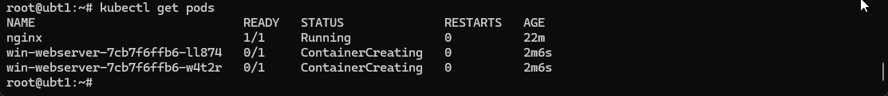

```
kubectl describe pod win-webserver-7cb7f6ffb6-ll874
```

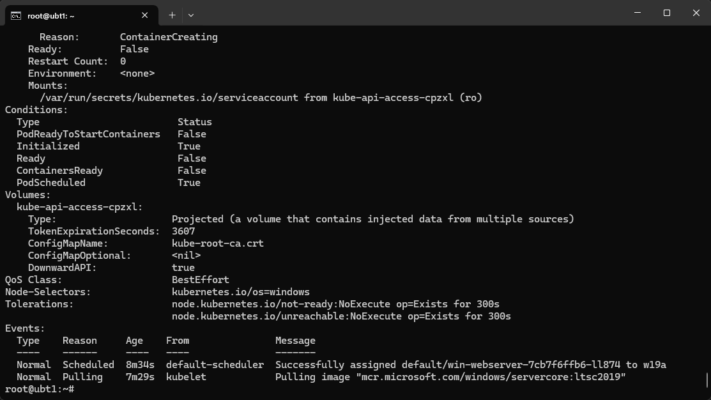

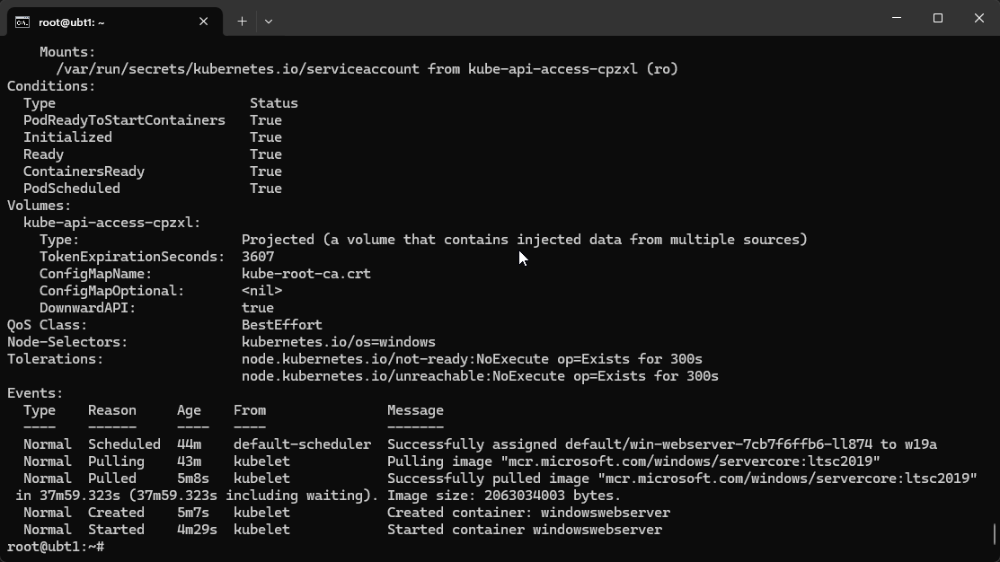

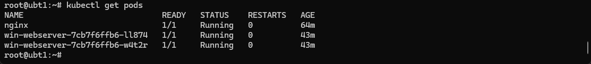

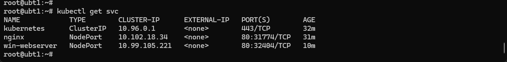

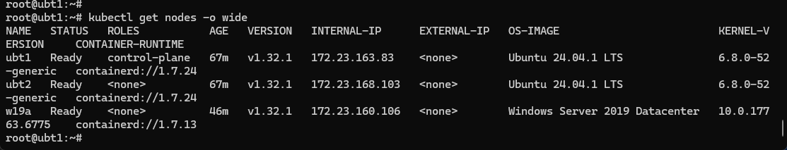

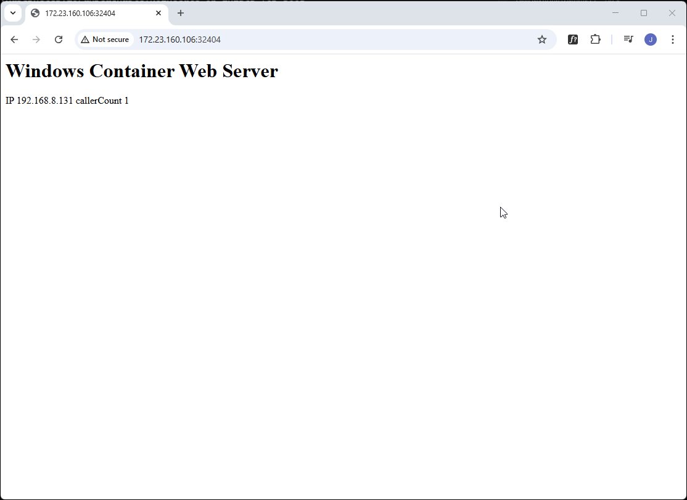

...


