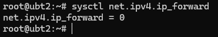
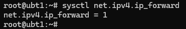

# Create a vanilla k8s cluster

## Container Runtimes

https://kubernetes.io/docs/setup/production-environment/container-runtimes/

### Enable IPv4 packet forwarding




```
# sysctl params required by setup, params persist across reboots
cat <<EOF | sudo tee /etc/sysctl.d/k8s.conf
net.ipv4.ip_forward = 1
EOF

# Apply sysctl params without reboot
sudo sysctl --system
```

```
sysctl net.ipv4.ip_forward
```



### Install Docker Engine on Ubuntu

On each of your nodes, install Docker for your Linux distribution as per Install Docker Engine

https://docs.docker.com/engine/install/ubuntu/

Set up Docker's apt repository.

```
# Add Docker's official GPG key:
sudo apt-get update
sudo apt-get install ca-certificates curl
sudo install -m 0755 -d /etc/apt/keyrings
sudo curl -fsSL https://download.docker.com/linux/ubuntu/gpg -o /etc/apt/keyrings/docker.asc
sudo chmod a+r /etc/apt/keyrings/docker.asc

# Add the repository to Apt sources:
echo \
  "deb [arch=$(dpkg --print-architecture) signed-by=/etc/apt/keyrings/docker.asc] https://download.docker.com/linux/ubuntu \
  $(. /etc/os-release && echo "${UBUNTU_CODENAME:-$VERSION_CODENAME}") stable" | \
  sudo tee /etc/apt/sources.list.d/docker.list > /dev/null
sudo apt-get update
```

Install the Docker packages.

```
sudo apt-get install docker-ce docker-ce-cli containerd.io docker-buildx-plugin docker-compose-plugin
```

Verify that the installation is successful by running the hello-world image:

```
sudo docker run hello-world
```

