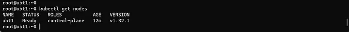
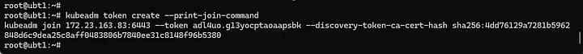
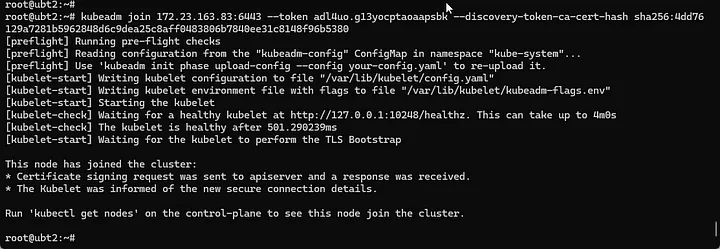
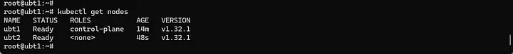
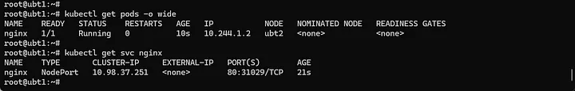
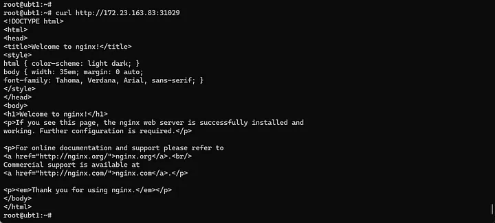
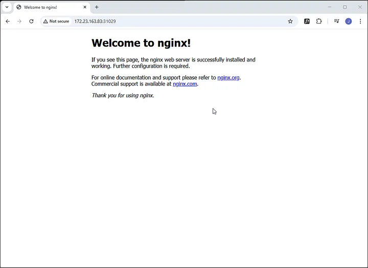

# Kubernetes + containerd + Calico on Ubuntu

## 1. Create the cluster

```
# Prerequisites

sudo apt update && sudo apt upgrade -y

sudo swapoff -a

cat <<EOF | sudo tee /etc/modules-load.d/k8s.conf
overlay
br_netfilter
EOF

sudo modprobe overlay
sudo modprobe br_netfilter

cat <<EOF | sudo tee /etc/sysctl.d/k8s.conf
net.bridge.bridge-nf-call-iptables = 1
net.bridge.bridge-nf-call-ip6tables = 1
net.ipv4.ip_forward = 1
EOF

sudo sysctl --system

# Install containerd

sudo apt install -y containerd

sudo mkdir -p /etc/containerd
containerd config default | sudo tee /etc/containerd/config.toml > /dev/null
sudo sed -i 's/SystemdCgroup = false/SystemdCgroup = true/g' /etc/containerd/config.toml
sudo sed -i 's|sandbox_image = "registry.k8s.io/pause:3.8"|sandbox_image = "registry.k8s.io/pause:3.10"|' /etc/containerd/config.toml
sudo systemctl restart containerd
sudo systemctl enable containerd

# Install Kubernetes tools

sudo apt-get install -y apt-transport-https ca-certificates curl gpg
curl -fsSL https://pkgs.k8s.io/core:/stable:/v1.32/deb/Release.key | sudo gpg --dearmor -o /etc/apt/keyrings/kubernetes-apt-keyring.gpg
echo 'deb [signed-by=/etc/apt/keyrings/kubernetes-apt-keyring.gpg] https://pkgs.k8s.io/core:/stable:/v1.32/deb/ /' | sudo tee /etc/apt/sources.list.d/kubernetes.list

sudo apt update
sudo apt install -y kubelet kubeadm kubectl
sudo systemctl enable kubelet

# Create a cluster

sudo kubeadm init --pod-network-cidr=10.244.0.0/16

mkdir -p $HOME/.kube
sudo cp -i /etc/kubernetes/admin.conf $HOME/.kube/config
sudo chown $(id -u):$(id -g) $HOME/.kube/config

kubectl get nodes

# Install Calico CNI

curl https://raw.githubusercontent.com/projectcalico/calico/v3.29.1/manifests/calico.yaml -O

kubectl apply -f calico.yaml

kubectl get nodes
```



Install calicoctl

```
curl -L https://github.com/projectcalico/calico/releases/download/v3.29.1/calicoctl-linux-amd64 -o calicoctl

chmod +x ./calicoctl
```

Ref. https://docs.tigera.io/calico/latest/operations/calicoctl/install

## 2. Join an Ubunto worker node

```
# Prerequisites

sudo apt update && sudo apt upgrade -y

sudo swapoff -a

cat <<EOF | sudo tee /etc/modules-load.d/k8s.conf
overlay
br_netfilter
EOF

sudo modprobe overlay
sudo modprobe br_netfilter

cat <<EOF | sudo tee /etc/sysctl.d/k8s.conf
net.bridge.bridge-nf-call-iptables = 1
net.bridge.bridge-nf-call-ip6tables = 1
net.ipv4.ip_forward = 1
EOF

sudo sysctl --system

# Install containerd

sudo apt install -y containerd

sudo mkdir -p /etc/containerd
containerd config default | sudo tee /etc/containerd/config.toml > /dev/null
sudo sed -i 's/SystemdCgroup = false/SystemdCgroup = true/g' /etc/containerd/config.toml
sudo sed -i 's|sandbox_image = "registry.k8s.io/pause:3.8"|sandbox_image = "registry.k8s.io/pause:3.10"|' /etc/containerd/config.toml
sudo systemctl restart containerd
sudo systemctl enable containerd

# Install Kubernetes tools

sudo apt-get install -y apt-transport-https ca-certificates curl gpg
curl -fsSL https://pkgs.k8s.io/core:/stable:/v1.32/deb/Release.key | sudo gpg --dearmor -o /etc/apt/keyrings/kubernetes-apt-keyring.gpg
echo 'deb [signed-by=/etc/apt/keyrings/kubernetes-apt-keyring.gpg] https://pkgs.k8s.io/core:/stable:/v1.32/deb/ /' | sudo tee /etc/apt/sources.list.d/kubernetes.list

sudo apt update
sudo apt install -y kubelet kubeadm kubectl
sudo systemctl enable kubelet
```

On the control plane node, run.

```
kubeadm token create — print-join-command
```



On the worker node, run

```
kubeadm join — token <token> <control-plane-host>:<control-plane-port> — discovery-token-ca-cert-hash sha256:<hash>
```



On the control plane node, run

```
kubectl get nodes
```



## 3. Test

```
kubectl run nginx --image=nginx --port=80
kubectl expose pod nginx --type=NodePort --port=80

kubectl get pods -o wide

kubectl get svc nginx
```



Test access.

```
curl http://<Worker_Node_IP>:<NodePort>
```




